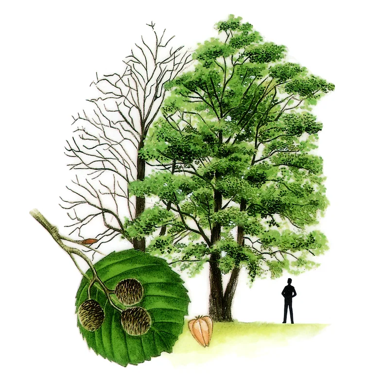
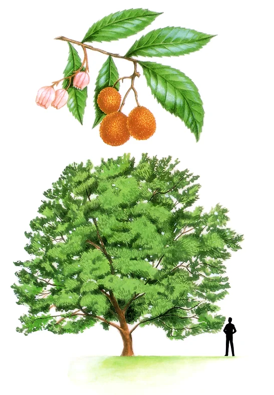
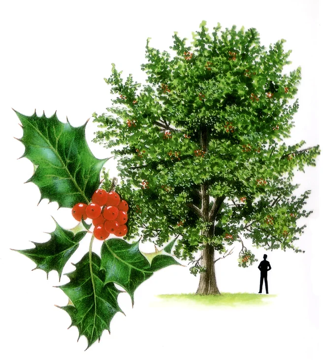
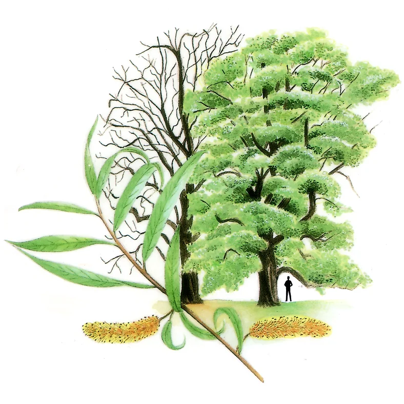
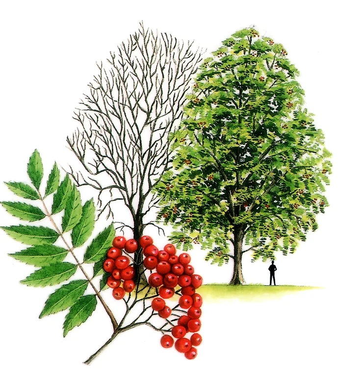
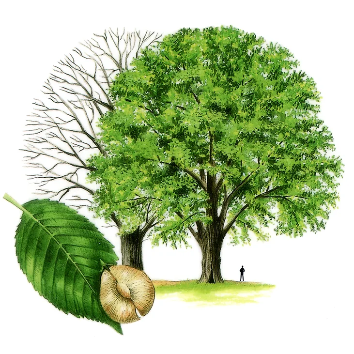
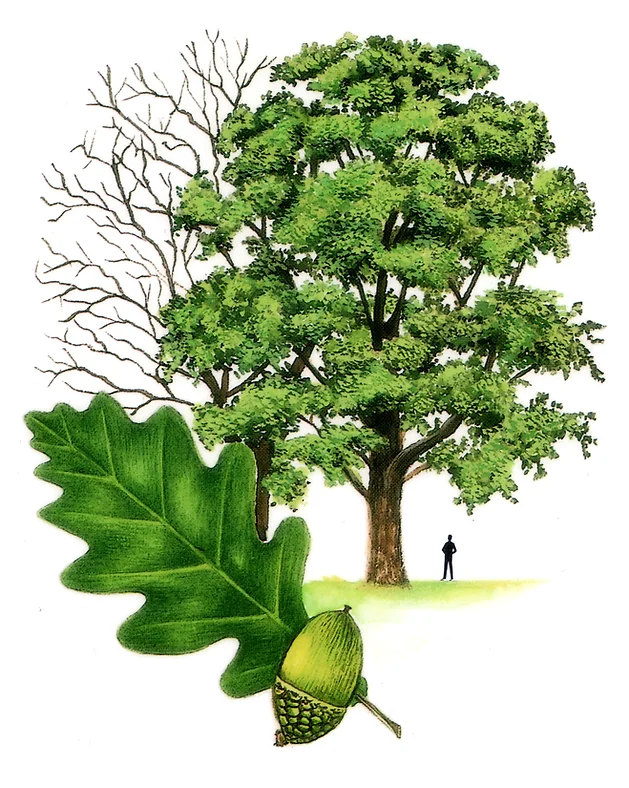
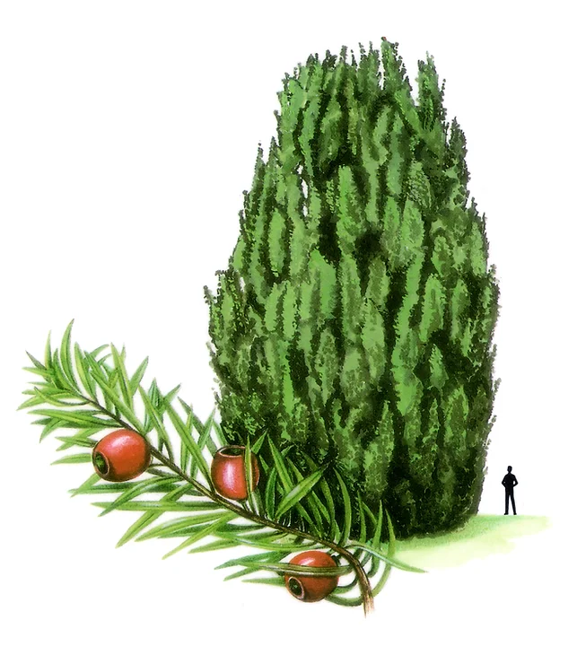
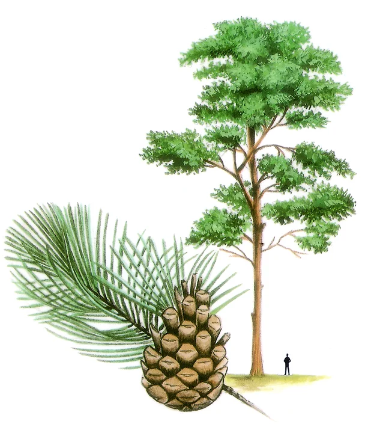

<!DOCTYPE html>
<html lang="en">
<head>
  <title>My First Web Page</title>
  <meta charset="utf-8">
  <meta name="viewport" content="width=device-width, initial-scale=5">
  <link rel="stylesheet" href="https://maxcdn.bootstrapcdn.com/bootstrap/3.4.1/css/bootstrap.min.css">
  
</head>
<body>
  <button onclick="topFunction()" id="myBtn">Back to the Top</button>

  <h1>Native Irish Trees</h1>
  
<b>Source:</b> Tree Council of Ireland © All rights reserved. Visit the:
    <a href="https://www.treecouncil.ie/" target="_blank">Tree Council of Ireland.ie</a>
   

<h2>List of Trees</h2>
<ol>
  <l><a href="#AlderTree"> Alder Tree .  </a></l>  <l><a href="#StrawberryTree"> Strawberry Tree .  </a></l>  <l><a href="#HollyTree"> Holly Tree .  </a></l>  <l><a href="#WillowTree"> Willow Tree .  </a></l>  <l><a href="#RowanTree"> Rowan Tree .  </a></l>  <l><a href="#ElmTree"> Elm Tree .  </a></l>  <l><a href="#OakTree"> Oak Tree .  </a></l>  <l><a href="#YewTree"> Yew Tree .  </a></l>  <l><a href="#ScotsPineTree"> Scots Pine Tree </a></l>
</ol>

  

    

      <h3 id="AlderTree">Alder Tree</h3>
      <h4>Fearnóg</h4>
      
      
One of Ireland’s most traditional and widely distributed trees, alders may be found in damp areas, beside freshwater loughs and along river banks, where their strong fibrous roots may help to keep the bank in place.
 
      
Alder woodlands are found in Ross Island, Killarney, Co Kerry and the Gearagh, Co. Cork, while Grantstown Wood, Co. Laois is a rare example of wet woodland on an alkaline soil.

      
Like most trees, alder flowers before the leaves are out, with attractive reddish catkins and small cones that contain the seeds. Alder will grow in most soils, and likes wet sites. Given rich damp soil alder will grow rapidly and is a really productive tree for timber. In ancient Ireland sections of alder trunks were used as round shields. Later, it was used for making clogs and also in the furniture trade where it was known as ‘Irish mahogany’.

      
As it is resistant to decay when submerged in water, alder is used to make sluice gates and other structures along streams, rivers and canals.

    

    

      <h3 id="StrawberryTree">Strawberry Tree</h3>
      <h4>Caithne</h4>
      
      
Arbutus or the strawberry tree is a small evergreen tree, which in Ireland can grow to be a forest tree reaching heights of up to 15 metres. It has an unusual distribution, as it only grows naturally throughout the Mediterranean and certain parts of Ireland.

      
Unlike many of our other native trees, which reached us via Great Britain, Arbutus is thought to have spread here over the land bridge from Brittany.

      
Called the strawberry tree because of the distinct shape and colour of its fruit, this species is found mainly in Co. Kerry especially in the Killarney district where it forms a large part of the natural forest on the islands and shores of the lakes. It is also found in unshaded parts of Glengariff Wood, Co. Cork and around Lough Gill in Co. Sligo.

      
Arbutus produces masses of white flowers in November and December. Since the fruit takes 12 months to ripen, the tree carries both mature fruit and flowers at the same time.

      
The fruit itself is edible, but as the Latin name unedo – ‘eat only once’ – implies, it is not very palatable.

    

    

      <h3 id="HollyTree">Holly Tree</h3>
      <h4>Cuileann</h4>
              
      
The evergreen holly is a native species which forms the shrub layer in some of our oldest woods. You may look for it in woodland, or in the narrow gullies of the Sperrins or Donegal uplands, where holly and rowan can survive the harsh upland conditions.

      
It is another visually attractive small tree very suitable for gardens as a specimen tree or as a hedge, slow growing and very dense.

      
Holly trees are either male or female – only the female can bear berries, so it is always worth planting several holly trees together. Both sexes bear small creamy flowers.

      
Although they drop their spiny leaves all the year round, especially in the heat of summer, they are green all year, and along with ivy were traditionally used for midwinter or Christmas decorations, as a sign of green life to come.

      
In some areas it is considered unlucky to cut down holly, and it may be left as standards along a hedgerow. The hard pale wood is valued for wood carving.

    

  

  

    

      

        <h3 id="WillowTree">Willow Tree</h3>
        <h4>Saileach</h4>
        
        
There are several varieties of willow native to Ireland. All grow in damp soil, have catkins or ‘pussy willows’ that produce seeds, but are most easily grown from cuttings, which root very readily.

        
The most widespread willow species are the goat willow, the rusty or grey willow (both known as ‘sallies’), and the eared willow.

        
While these generally grow on damp ground, the goat willow will also colonise rough and disturbed ground in drier areas. The bay leaved willow, with glossy green leaves, is found beside small rivers and ditches.

        
Osiers, with long fine leaves, do not develop into large trees. They were often grown and managed by cutting right back to the base to encourage long flexible shoots used for baskets. Now this species may be grown for biomass and provide a renewable energy source.

        
All willows are rich in insects and so provide a good food source for insect eating birds in summer, notably for the willow warbler.

        

      

        <h3 id="RowanTree">Rowan Tree</h3>
        <h4>Caorthann</h4>
        
        
Rowan adds colour to woodland throughout Ireland, especially in the hills where it will grow at a high altitude even on rocky ground: its other common name is mountain ash.

        
The creamy flowers ripen into scarlet berries which colour early in the season and provide food for thrushes through the winter.

        
A mistle thrush will defend a rowan tree or holly as its territory, not for nesting, but through the winter as its feeding territory.

        
Rowan is an attractive garden tree: it likes well drained sites but will thrive in most soils.

        
Various parts of the Rowan tree, including its bark, berries, and leaves, have been used in traditional medicine. The berries are rich in vitamin C and have been used to make jams, jellies, and alcoholic beverages. The bark and leaves were also used to treat ailments such as diarrhea, sore throats, and fevers.

      

      

        <h3 id="ElmTree">Elm Tree</h3>
        <h4>Leamhán sléibhe</h4>
        
        
The wych elm is native, but many varieties of wych elm and smooth leaved elm have been introduced and planted in Ireland in the past, mostly for timber.

        
Wych elm is chiefly found in mountain glens in the northwest of the country.

        
English elm was mainly planted in demesnes. In recent years many of these trees have died as a result of Dutch elm disease.

        
English elms will re-grow from stumps and will form suckers in woodland or hedgerows – these may be used for propagation.

        
The Irish wych elm, which is less common, appears more resistant to disease. It does not produce suckers and must be grown from seed. Leaves are rough to the touch, oval withtoothed margins.

        
The flowers, as with many trees, appear before the leaves. They are reddish clusters borne directly on the twigs, and are not obvious until they mature into pale green seeds which almost look like leaves, except they ripen and fall soon after the real leaves appear.

      

  

    

      
        
        

          <h3 id="OakTree">Oak Tree</h3>
          <h4>Dair ghaelach</h4>
          
          
The traditional Irish oak is the sessile oak. It is the main species to be found in Ireland’s most familiar woodlands.

          
Sessile oak is found more commonly on poor acid soils, often in hilly regions. These woodlands can be found in Killarney, Co. Kerry, the Glen of the Downs, Co. Wicklow and Glenveagh, Co. Donegal, to name but a few.

          
They are important ecologically as habitats for hundreds of invertebrate species along with many species of birds and mammals. Sessile means that the acorns have no stalk while those of the pedunculate oak hang from long stalks.

          
Once widespread throughout Ireland, centuries of harvesting, with few trees being replaced, means that truly native oak can be hard to find, though there are small woods in most counties.

          
Very often, semi-natural oak woodlands contain a proportion of birch and ash, with hazel, holly and rowan scattered throughout the understorey.

          
Oak has been harvested for its fine timber for centuries and is much prized for its visual qualities and durability. It is commonly used in the making of furniture, for veneers and in the manufacture of casks.

          
The male flowers of oak are borne on rather inconspicuous catkins, which come out just before the leaves, but the seeds – acorns – are far more obvious. Oak trees do not produce a good crop every year, so it is worth gathering plenty in a good year.

        

        

          <h3 id="YewTree">Yew Tree</h3>
          <h4>Iúr</h4>
                  
          
The yew is native and may be found in old woods although it is often seen in the artificial surroundings of estates or churchyards.

          
An evergreen conifer (although an unusual one), yew is a dramatic tree with its dark foliage and red berries encasing a single seed. Reenadina wood on the Muckross Peninsula, Co. Kerry is Ireland’s only native yew wood.

          
A sport (unique form) of the Irish yew (Taxus baccata ‘fastigata’) with very upright growth was originally found growing on rocky limestone hills in Co. Fermanagh. This was cultivated at Florencecourt, and subsequently in many gardens and churchyards.

          
Many yews are single sex, but most Irish yews are female and so bear fruit. Even if the flesh is removed, these may be slow to germinate.

          
The best seeds are those that have been eaten by birds and have passed through them; such bare seeds may be collected from under yew trees.

          
There are ornamental garden varieties, some with yellow fruit or even golden foliage – these have to be propagated by cuttings. Yew trees do not need rich soil but they do need a well drained site, preferably not too exposed to wind or frost.

          
The leaves are poisonous to most livestock, and the seeds are also toxic, so care must be taken in planting it where animals and children are not at risk. The fruit can be eaten safely by birds, and yew is in fact a good tree for wildlife as birds roost and nest in it.

        

        

          <h3 id="ScotsPineTree">Scots Pine Tree</h3>
          <h4>Péine albanach</h4>
                  
          
Originally a native tree. Pollen found in soil samples from bogs indicates that Scots pine was widespread in Ireland thousands of years ago.

          
Human impact and the gradual change to a warmer, wetter climate led to its decline, and it may even have died out completely.

          
Pine stumps have been found in bogs, standing where they grew, 7,000 years ago, before the formation of the peat. Most of the pines around the countryside now were imported from Scotland and planted over the last 150 years.

          
Efforts have been made to reintroduce this once native species as in some situations it is fitting that Scots pine be encouraged. It can be grown on marginal land where other species of tree would not survive. It also matures quicker and produces more versatile wood than broadleaf trees.

          
Even though it is a coniferous tree, it nonetheless supports a wide variety of wildlife as habitat diversity changes in line with canopy closure.

          
Our native red squirrel prefers the seeds of this tree than any other.

        

      

    

  

</body>
</html>
